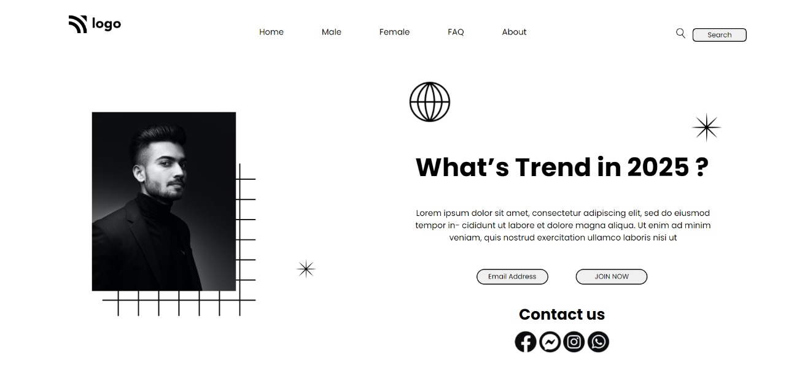

## Hey there ,  I am Amarjeet 
 I have built a template of HTML and CSS project using my core css skills 

## About my Project
- This is my first project of HTML and CSS . -u orogin 
- In this project i am created   a  Simple front page by using HTML and CSS only.
- During making of this project i learn alot about position .
-  
 
 
 

## Time spend 
This is my first project , and I'm new in this field so i spend aprox 5 hour to make this project ready.

## Link of my project .
- By clicking on below link you can see my web-page of this project on Netlify .
- [Live Link....](https://app.netlify.com/sites/funny-choux-139d35/overview)

## Screenshot of my web page.
 
